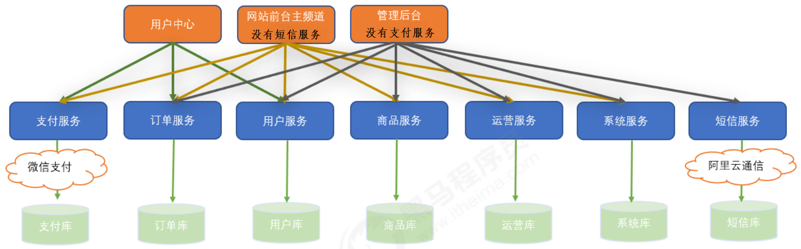

## 第二节 青橙-需求分析与系统设计

### 2.1 需求分析

《青橙》是一个全品类 B2C 电商平台，包含**网站前台和管理后台**两大部分。
* 网站前台包含**主站频道（首页、搜索、购物车及支付）、用户中心、秒杀、优惠券等频道**。
* 管理后台包含**商品、订单、库存、用户、运营、统计、财务、设置**等功能。具体功能项目**静态原型**。

### 2.2 系统设计

#### 2.2.1 数据库分库设计

（1）商品库 qingcheng_goods
（2）订单库 qingcheng_order
（3）基础设置库 qingcheng_config
（4）运营库 qingcheng_business
（5）用户库 qingcheng_user
（6）系统库 qingcheng_system
（7）支付库 qingcheng_pay
（8）短信库 qingcheng_sms

8 个主要数据库，还会涉及一些其他数据库。

#### 2.2.2 技术选型

* 主框架技术：SSM（通用 mapper）+ Dubbo
* 前端技术：网站后台 Vue.js+ElementUI、网站前台采用 Vue.js 和模板技术 thymeleaf
* 消息中间件技术：RabbitMQ
* 搜索中间件技术：elasticsearch
* 缓存中间件技术：redis
* 报表插件：echars
* 安全框架：SpringSecurity
* 单点登录中间件：CAS

#### 2.2.3 系统架构图

