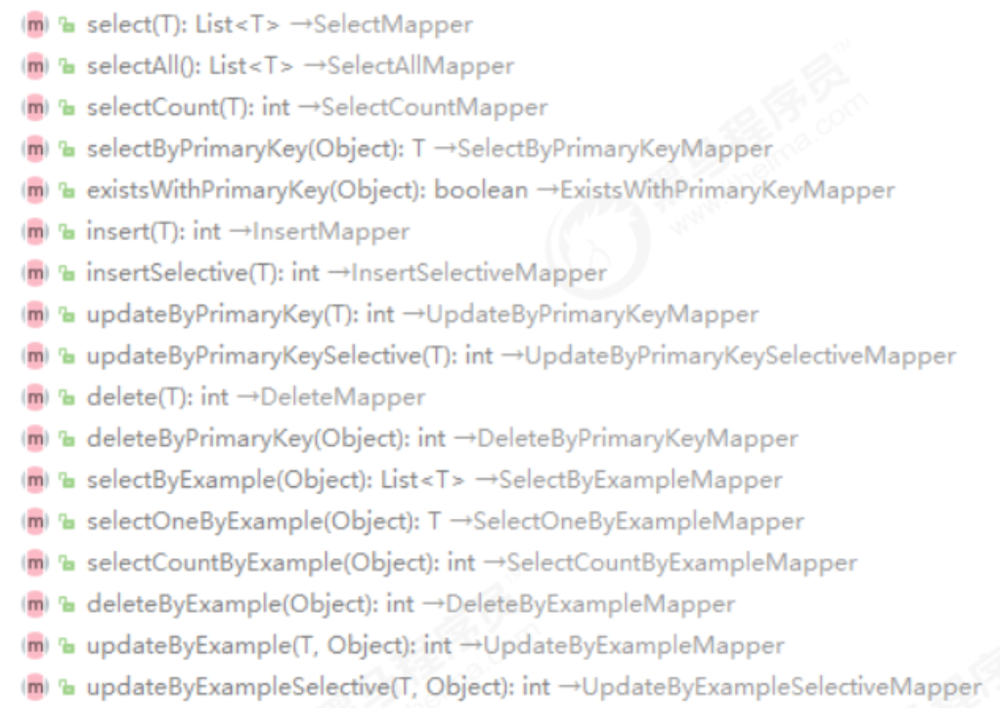

## 第三节 通用 mapper

### 3.1 通用 mapper 简介

&emsp;&emsp;通用 Mapper 是一个可以实现任意 MyBatis 通用方法的框架，项目提供了常规的增删改查操作以及 Example 相关的单表操作。

为什么要用通用 mapper？（原生 Mybatis 的痛点）

* 1、mapper.xml 文件里有大量的 sql，**当数据库表字段变动，配置文件就要修改**。

* 2、**需要自己实现 sql 分页**，select * from table where ... limit 1,3。自己手写分页，除了传参 page、pageSize，还需要返回条目总数 count。

* 3、数据库**可移植性差**：如果项目更换数据库，比如 oracle-->mysql，mapper.xml 中的 sql 要重新写，因为 Oracle 的 PLSQL 和 mysql 支持的函数是不同的。

* 4、生成的**代码量过大**。

* 5、**批量操作，批量插入，批量更新，需要自写**。

而这些，通过通用 mapper 可以很轻松的解决。


### 3.2 通用 mapper 快速入门

在线官方文档：https://gitee.com/free/Mapper/wikis/Home

#### 3.2.1 通用 mapper 与 Spring 集成

官方的文档中介绍了通用 mapper 的三种使用方式 ，纯 java 使用方式、与 Spring 集成方式、与 SpringBoot 集成方式。这里介绍与 Spring 集成方式。

##### 3.2.1.1 引入依赖

正常情况下，Spring 和 MyBatis 的集成环境中，应该已经存在下面的依赖：

```xml
<dependency>
    <groupId>org.mybatis</groupId>
    <artifactId>mybatis</artifactId>
    <version>版本号</version>
</dependency>
<dependency>
    <groupId>org.mybatis</groupId>
    <artifactId>mybatis‐spring</artifactId>
    <version>版本号</version>
</dependency>
<dependency>
    <groupId>org.springframework</groupId>
    <artifactId>spring‐context</artifactId>
    <version>版本号</version>
</dependency>
<dependency>
    <groupId>org.springframework</groupId>
    <artifactId>spring‐tx</artifactId>
    <version>版本号</version>
</dependency>
<dependency>
    <groupId>org.springframework</groupId>
    <artifactId>spring‐jdbc</artifactId>
    <version>版本号</version>
</dependency>
```

集成通用 Mapper 在上面的基础上添加下面的依赖：

```xml
<dependency>
    <groupId>tk.mybatis</groupId>
    <artifactId>mapper</artifactId>
    <version>最新版本</version>
</dependency>
```

##### 3.2.1.2 与 spring 集成

直接使用 tk.mybatis 提供的 `tk.mybatis.spring.mapper.MapperScannerConfigurer` 进行配置，这个配置和 MyBatis 官方提供的 `org.mybatis.spring.mapper.MapperScannerConfigurer` 区别只是第一层的包名，tk 和 org。所以使用这种方式时，如果你项目已经使用 `org.` 进行了配置，只需要改成 `tk.` 即可。

```xml
<bean class="tk.mybatis.spring.mapper.MapperScannerConfigurer">
    <property name="basePackage" value="扫描包名"/>
</bean>
```

项目中采用的是这种 xml 的配置方式，通用 mapper 还提供了注解方式的配置，详见
文档。


#### 3.2.2 实体类映射

实体类映射类似下列形式:

```java
@Table(name="tb_brand")
public class Brand implements Serializable{
    @Id 
    private Integer id;
    private String name;
    //getter and setter ....
}
```

`@Table` 是指定**实体类对应的数据库表**，`@Id` 指的是**主键映射**。经过上面简单的配置后，相
当于有了 MyBatis 中的关系映射。


#### 3.2.3 创建 Mapper 接口

```java
public interface BrandMapper extends Mapper<Brand> {
}
```

这里继承了 `tk.mybatis.mapper.common.Mapper` 接口，**在接口上指定泛型类型** Brand。**当继承了 Mapper 接口后，此时就已经有了针对 Brand 的大量方法**(无需自己再编写方法)，方法如下：



这些方法和 MBG 生成的大部分方法都一致，还有一部分 MBG 之外的常用方法。

##### 3.2.3.1 基础接口 select 

```java
List<T> select(T record)
//根据T对象中的属性名称查询，类似于select * from table where t.name=#{name} and
t.password = #{password}
```

```java
T selectOne(T record)
//根据实体中的属性进行查询，只能有一个返回值，有多个结果是抛出异常，查询条件使用等号
```

```java
T selectByPrimaryKey(Object key)
//根据主键查询 
//说明：根据主键字段进行查询，方法参数必须包含完整的主键属性，查询条件使用等号
```

```java
int selectCount(T record);
//说明：根据实体中的属性查询总数，查询条件使用等号
```

##### 3.2.3.2 基础接口 insert

```java
int insert(T record);
//说明：保存一个实体，【null 的属性也会保存，不会使用数据库默认值】
```

```java
int insertSelective(T record);
//说明：保存一个实体，【null 的属性不会保存，会使用数据库默认值】
```


##### 3.2.3.3 基础接口 Update

```java
int updateByPrimaryKey(T record);
//说明：根据【主键】更新实体全部字段，【null值会被更新】
```

```java
int updateByPrimaryKeySelective(T record);
//说明：根据【主键】更新属性【不为null】的值
```


##### 3.2.3.4 基础接口 delete

```java
int delete(T record);
//说明：根据【实体属性】作为条件进行删除，查询条件使用等号
```

```java
int deleteByPrimaryKey(Object key);
//说明：根据【主键字段】进行删除，方法参数【必须包含完整的主键属性】
```
