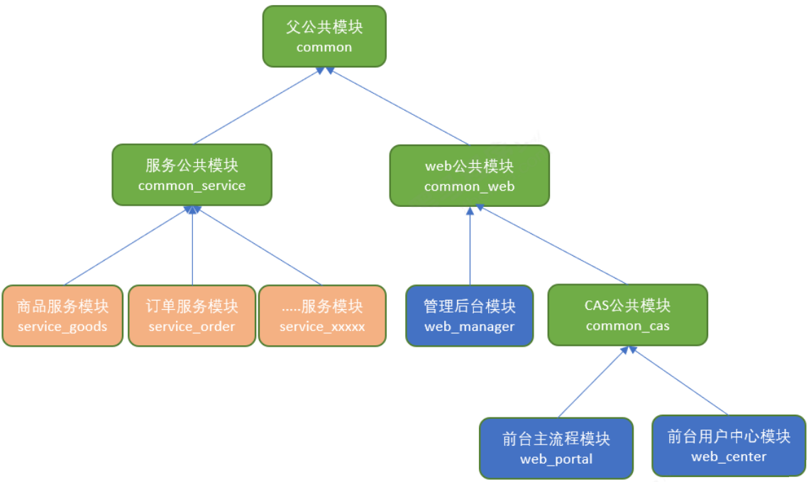

## 第四节 青橙工程搭建

### 4.1 准备工作

（1）配置 maven 本地仓库
（2）创建数据库表 
（3）注册中心 zookeeper 

### 4.2 模块依赖关系图

工程共有**三种模块**：（1）公共模块 （2）服务层模块 （3）web 层模块。

公共模块主要由**公共配置和公共类**构成。模块依赖关系入下图：




### 4.3 工程搭建

#### 4.3.1 父工程与公共模块

##### 4.3.1.1 父工程 qingcheng_parent

创建父工程 `qingcheng_parent`，包名为 `com.qingcheng`。在 pom.xml 添加配置

```xml
<?xml version="1.0" encoding="UTF-8"?>
<project xmlns="http://maven.apache.org/POM/4.0.0"
         xmlns:xsi="http://www.w3.org/2001/XMLSchema-instance"
         xsi:schemaLocation="http://maven.apache.org/POM/4.0.0 http://maven.apache.org/xsd/maven-4.0.0.xsd">
    <modelVersion>4.0.0</modelVersion>

    <groupId>com.qingcheng</groupId>
    <artifactId>qingcheng_parent</artifactId>
    <version>1.0-SNAPSHOT</version>

    <packaging>pom</packaging>

    <!-- 集中定义依赖版本号 -->
    <properties>
        <junit.version>4.12</junit.version>
        <spring.version>5.0.5.RELEASE</spring.version>
        <pagehelper.version>4.1.4</pagehelper.version>
        <servlet-api.version>2.5</servlet-api.version>
        <dubbo.version>2.6.0</dubbo.version>
        <zookeeper.version>3.4.7</zookeeper.version>
        <zkclient.version>0.1</zkclient.version>
        <mybatis.version>3.4.5</mybatis.version>
        <mybatis.spring.version>1.3.1</mybatis.spring.version>
        <mybatis.paginator.version>1.2.15</mybatis.paginator.version>
        <mysql.version>5.1.32</mysql.version>
        <druid.version>1.0.9</druid.version>
        <commons-fileupload.version>1.3.1</commons-fileupload.version>
        <spring.security.version>5.0.5.RELEASE</spring.security.version>
        <jackson.version>2.9.4</jackson.version>
    </properties>

    <!-- 依赖管理标签  必须加 -->
    <!-- 此标签内的依赖并没有被加载，只是约束了版本 -->
    <dependencyManagement>
        <dependencies>
            <!-- Spring -->
            <dependency>
                <groupId>org.springframework</groupId>
                <artifactId>spring-context</artifactId>
                <version>${spring.version}</version>
            </dependency>
            <dependency>
                <groupId>org.springframework</groupId>
                <artifactId>spring-beans</artifactId>
                <version>${spring.version}</version>
            </dependency>
            <dependency>
                <groupId>org.springframework</groupId>
                <artifactId>spring-web</artifactId>
                <version>${spring.version}</version>
            </dependency>
            <dependency>
                <groupId>org.springframework</groupId>
                <artifactId>spring-webmvc</artifactId>
                <version>${spring.version}</version>
            </dependency>
            <dependency>
                <groupId>org.springframework</groupId>
                <artifactId>spring-jdbc</artifactId>
                <version>${spring.version}</version>
            </dependency>
            <dependency>
                <groupId>org.springframework</groupId>
                <artifactId>spring-aspects</artifactId>
                <version>${spring.version}</version>
            </dependency>
            <dependency>
                <groupId>org.springframework</groupId>
                <artifactId>spring-jms</artifactId>
                <version>${spring.version}</version>
            </dependency>
            <dependency>
                <groupId>org.springframework</groupId>
                <artifactId>spring-context-support</artifactId>
                <version>${spring.version}</version>
            </dependency>
            <dependency>
                <groupId>org.springframework</groupId>
                <artifactId>spring-test</artifactId>
                <version>${spring.version}</version>
            </dependency>
            <!-- dubbo相关 -->
            <dependency>
                <groupId>com.alibaba</groupId>
                <artifactId>dubbo</artifactId>
                <version>${dubbo.version}</version>
            </dependency>
            <dependency>
                <groupId>org.apache.zookeeper</groupId>
                <artifactId>zookeeper</artifactId>
                <version>${zookeeper.version}</version>
            </dependency>
            <dependency>
                <groupId>com.github.sgroschupf</groupId>
                <artifactId>zkclient</artifactId>
                <version>${zkclient.version}</version>
            </dependency>
            <dependency>
                <groupId>junit</groupId>
                <artifactId>junit</artifactId>
                <version>4.12</version>
            </dependency>
            <dependency>
                <groupId>com.alibaba</groupId>
                <artifactId>fastjson</artifactId>
                <version>1.2.47</version>
            </dependency>
            <dependency>
                <groupId>javassist</groupId>
                <artifactId>javassist</artifactId>
                <version>3.12.1.GA</version>
            </dependency>
            <dependency>
                <groupId>commons-codec</groupId>
                <artifactId>commons-codec</artifactId>
                <version>1.10</version>
            </dependency>
            <dependency>
                <groupId>com.github.pagehelper</groupId>
                <artifactId>pagehelper</artifactId>
                <version>${pagehelper.version}</version>
            </dependency>
            <!-- Mybatis -->
            <dependency>
                <groupId>org.mybatis</groupId>
                <artifactId>mybatis</artifactId>
                <version>${mybatis.version}</version>
            </dependency>
            <dependency>
                <groupId>org.mybatis</groupId>
                <artifactId>mybatis-spring</artifactId>
                <version>${mybatis.spring.version}</version>
            </dependency>
            <dependency>
                <groupId>com.github.miemiedev</groupId>
                <artifactId>mybatis-paginator</artifactId>
                <version>${mybatis.paginator.version}</version>
            </dependency>
            <!-- MySql -->
            <dependency>
                <groupId>mysql</groupId>
                <artifactId>mysql-connector-java</artifactId>
                <version>${mysql.version}</version>
            </dependency>
            <!-- 连接池 -->
            <dependency>
                <groupId>com.alibaba</groupId>
                <artifactId>druid</artifactId>
                <version>${druid.version}</version>
            </dependency>
            <!-- 文件上传组件 -->
            <dependency>
                <groupId>commons-fileupload</groupId>
                <artifactId>commons-fileupload</artifactId>
                <version>${commons-fileupload.version}</version>
            </dependency>
            <!-- 安全框架 -->
            <dependency>
                <groupId>org.springframework.security</groupId>
                <artifactId>spring-security-web</artifactId>
                <version>${spring.security.version}</version>
            </dependency>
            <dependency>
                <groupId>org.springframework.security</groupId>
                <artifactId>spring-security-config</artifactId>
                <version>${spring.security.version}</version>
            </dependency>
            <dependency>
                <groupId>org.springframework.security</groupId>
                <artifactId>spring-security-taglibs</artifactId>
                <version>${spring.security.version}</version>
            </dependency>
            <dependency>
                <groupId>org.springframework.security</groupId>
                <artifactId>spring-security-cas</artifactId>
                <version>${spring.version}</version>
            </dependency>
            <dependency>
                <groupId>com.github.penggle</groupId>
                <artifactId>kaptcha</artifactId>
                <version>2.3.2</version>
                <exclusions>
                    <exclusion>
                        <groupId>javax.servlet</groupId>
                        <artifactId>javax.servlet-api</artifactId>
                    </exclusion>
                </exclusions>
            </dependency>
            <dependency>
                <groupId>dom4j</groupId>
                <artifactId>dom4j</artifactId>
                <version>1.6.1</version>
            </dependency>
            <dependency>
                <groupId>xml-apis</groupId>
                <artifactId>xml-apis</artifactId>
                <version>1.4.01</version>
            </dependency>
            <!-- 缓存 -->
            <dependency>
                <groupId>redis.clients</groupId>
                <artifactId>jedis</artifactId>
                <version>2.9.0</version>
            </dependency>
            <dependency>
                <groupId>org.springframework.data</groupId>
                <artifactId>spring-data-redis</artifactId>
                <version>2.0.5.RELEASE</version>
            </dependency>
            <dependency>
                <groupId>com.fasterxml.jackson.core</groupId>
                <artifactId>jackson-core</artifactId>
                <version>${jackson.version}</version>
            </dependency>
            <dependency>
                <groupId>com.fasterxml.jackson.core</groupId>
                <artifactId>jackson-databind</artifactId>
                <version>${jackson.version}</version>
            </dependency>
            <dependency>
                <groupId>com.fasterxml.jackson.core</groupId>
                <artifactId>jackson-annotations</artifactId>
                <version>${jackson.version}</version>
            </dependency>
            <!--通用Mapper-->
            <dependency>
                <groupId>tk.mybatis</groupId>
                <artifactId>mapper</artifactId>
                <version>4.1.4</version>
            </dependency>
            <dependency>
                <groupId>org.apache.httpcomponents</groupId>
                <artifactId>httpclient</artifactId>
                <version>4.5.7</version>
            </dependency>
            <dependency>
                <groupId>com.aliyun.oss</groupId>
                <artifactId>aliyun-sdk-oss</artifactId>
                <version>2.8.2</version>
            </dependency>
            <dependency>
                <groupId>org.elasticsearch.client</groupId>
                <artifactId>elasticsearch-rest-high-level-client</artifactId>
                <version>6.2.1</version>
            </dependency>
            <dependency>
                <groupId>org.springframework.amqp</groupId>
                <artifactId>spring-rabbit</artifactId>
                <version>2.1.4.RELEASE</version>
            </dependency>
        </dependencies>
    </dependencyManagement>
    
    <!-- 此处被加载 -->
    <dependencies>
        <dependency>
            <groupId>javax.servlet</groupId>
            <artifactId>servlet-api</artifactId>
            <version>${servlet-api.version}</version>
            <scope>provided</scope>
        </dependency>
    </dependencies>
    
    <build>
        <plugins>
            <plugin>
                <groupId>org.apache.maven.plugins</groupId>
                <artifactId>maven-compiler-plugin</artifactId>
                <configuration>
                    <source>8</source>
                    <target>8</target>
                </configuration>
            </plugin>
        </plugins>
    </build>
</project>
```

父工程模块是没有代码的，删除 src 文件夹。


##### 4.3.1.2 公共模块 qingcheng_common 

创建公共模块 `qingcheng_common` 

###### pom.xml 配置

 ```xml
<?xml version="1.0" encoding="UTF-8"?>
<project xmlns="http://maven.apache.org/POM/4.0.0"
         xmlns:xsi="http://www.w3.org/2001/XMLSchema-instance"
         xsi:schemaLocation="http://maven.apache.org/POM/4.0.0 http://maven.apache.org/xsd/maven-4.0.0.xsd">
    <parent>
        <artifactId>qingcheng_parent</artifactId>
        <groupId>com.qingcheng</groupId>
        <version>1.0-SNAPSHOT</version>
    </parent>
    <modelVersion>4.0.0</modelVersion>

    <artifactId>qingcheng_common</artifactId>

    <!--公共模块-->
    <dependencies>
        <!-- Spring -->
        <dependency>
            <groupId>org.springframework</groupId>
            <artifactId>spring-context</artifactId>
        </dependency>
        <dependency>
            <groupId>org.springframework</groupId>
            <artifactId>spring-beans</artifactId>
        </dependency>
        <dependency>
            <groupId>org.springframework</groupId>
            <artifactId>spring-web</artifactId>
        </dependency>
        <dependency>
            <groupId>org.springframework</groupId>
            <artifactId>spring-webmvc</artifactId>
        </dependency>
        <dependency>
            <groupId>org.springframework</groupId>
            <artifactId>spring-jdbc</artifactId>
        </dependency>
        <dependency>
            <groupId>org.springframework</groupId>
            <artifactId>spring-aspects</artifactId>
        </dependency>
        <dependency>
            <groupId>org.springframework</groupId>
            <artifactId>spring-jms</artifactId>
        </dependency>
        <dependency>
            <groupId>org.springframework</groupId>
            <artifactId>spring-context-support</artifactId>
        </dependency>
        <dependency>
            <groupId>org.springframework</groupId>
            <artifactId>spring-test</artifactId>
        </dependency>
        <!-- dubbo相关 -->
        <dependency>
            <groupId>com.alibaba</groupId>
            <artifactId>dubbo</artifactId>
        </dependency>
        <dependency>
            <groupId>org.apache.zookeeper</groupId>
            <artifactId>zookeeper</artifactId>
        </dependency>
        <dependency>
            <groupId>com.github.sgroschupf</groupId>
            <artifactId>zkclient</artifactId>
        </dependency>
        <dependency>
            <groupId>junit</groupId>
            <artifactId>junit</artifactId>
        </dependency>
        <dependency>
            <groupId>com.alibaba</groupId>
            <artifactId>fastjson</artifactId>
        </dependency>
        <dependency>
            <groupId>javassist</groupId>
            <artifactId>javassist</artifactId>
        </dependency>
        <dependency>
            <groupId>commons-codec</groupId>
            <artifactId>commons-codec</artifactId>
        </dependency>
    </dependencies>
</project>
 ```

###### applicationContext-common.xml 配置

在 resources 下创建 `applicationContext-common.xml`  

```xml
<?xml version="1.0" encoding="UTF-8"?>
<beans xmlns="http://www.springframework.org/schema/beans"
	xmlns:context="http://www.springframework.org/schema/context"
	xmlns:xsi="http://www.w3.org/2001/XMLSchema-instance"
	xsi:schemaLocation="http://www.springframework.org/schema/beans http://www.springframework.org/schema/beans/spring-beans-4.2.xsd
	http://www.springframework.org/schema/context http://www.springframework.org/schema/context/spring-context.xsd">
	<!-- 作用：加载所有扩展名为 properties 的配置文件 -->
	<context:property-placeholder location="classpath*:*.properties" />
</beans>
```

###### log4j.properties 配置日志

在 resources 下创建 `log4j.properties` 文件

```properties
### direct log messages to stdout ###
log4j.appender.stdout=org.apache.log4j.ConsoleAppender
log4j.appender.stdout.Target=System.err
log4j.appender.stdout.layout=org.apache.log4j.PatternLayout
log4j.appender.stdout.layout.ConversionPattern=%d{ABSOLUTE} %5p %c{1}:%L - %m%n

### direct messages to file mylog.log ###
log4j.appender.file=org.apache.log4j.FileAppender
log4j.appender.file.File=c:\\mylog.log
log4j.appender.file.layout=org.apache.log4j.PatternLayout
log4j.appender.file.layout.ConversionPattern=%d{ABSOLUTE} %5p %c{1}:%L - %m%n

### set log levels - for more verbose logging change 'info' to 'debug' ###
log4j.rootLogger=debug, stdout
```

###### zk.properties 配置 zk 链接地址

在 resources 下创建 `zk.properties` 文件

```properties
zk.address=127.0.0.1:2181
```

##### 4.3.1.3 服务公共模块 qingcheng_common_service 


##### 4.3.1.4 web 公共模块 qingcheng_common_web


##### 4.3.1.5 实体层模块 qingcheng_pojo

##### 4.3.1.6 服务接口层模块 qingcheng_interface

​      

#### 4.3.2 服务层模块（商品）


#### 4.3.3 web层（管理后台

