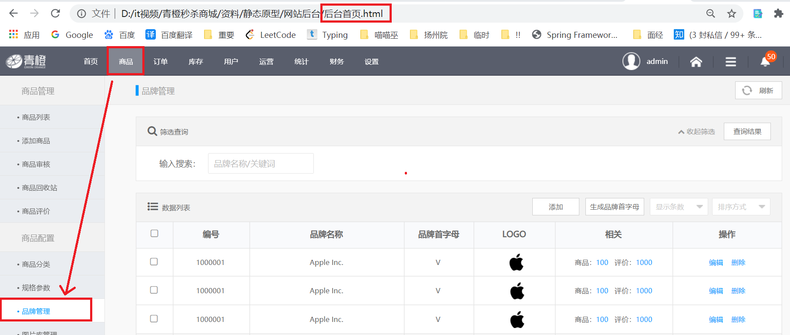

## 第五节 青橙管理后台-品牌管理后端

### 5.1 需求分析

&emsp;&emsp;实现对品牌的基本操作（增删改查），只完成后端代码部分，并通过浏览器等工具完成测试。




### 5.2 表结构分析

**tb_brand 品牌表** 

| 字段名称 | 字段含义 | 字段类型 | 字段长度 | 备注 |
|  ----  | ----  |  ----  |  ----  |  ----  |
| id | 品牌 id | INT |   |  |
| name | 品牌名称 | VARCHAR | 100 |  |
| image | 品牌图片地址 | VARCHAR | 1000 |  |
| letter | 品牌首字母 | CHAR | 1 |  |
| seq | 排序 | INT |  | 搜索时，列举各个品牌时，需要排序 |

### 5.3 代码实现

#### 5.3.1 品牌列表

##### 5.3.1.1 创建品牌表(tb_brand)的实体类 

品牌表 (tb_brand) 在商品数据库 (goods)，创建实体类步骤如下：

1. 在 `qingcheng_pojo` 模块的 java 目录下创建 `com.qingcheng.pojo.goods` 多级包。
2. 其下创建实体类 `Brand.java`，并实现可序列化接口 `Serializable`。
3. 添加 `@Table` 与 `@Id` 注解。

```java
package com.qingcheng.pojo.goods;

import javax.persistence.Id;
import javax.persistence.Table;
import java.io.Serializable;

//如果表明与类名一致（只是首字母大写），则 name 可以省略
@Table(name = "tb_brand")
public class Brand implements Serializable{

    //该注解用于标注主键
    @Id
    private Integer id;    //品牌id
    private String name;   //品牌名称
    private String image;  //品牌图片地址
    private String letter; //品牌的首字母
    private Integer seq;   //排序
    
    // 省略对应的 getter & setter 方法...
}
```

注：

* 为了加以区分，将每个数据库所对应的所有实体类存放在相同的包下，**不同数据库存放在不同包下**。
* **实体类命名**：一般来说，实体类的类名与表名是相同的。但是，如果表明带前缀，前缀可以省略，并且首字母大写。 **tb_brand 表 --> Brand 实体类**。
* **为什么要实现可序列化接口 Serializable**：实体类本身需要在网络上传输（dubbo 分布式框架）。

##### 5.3.1.2 品牌数据访问层 dao

数据访问层，要放到 qingcheng_service_goods 模块。

1. 在该模块的 java 文件夹下，创建 `com.qingcheng.dao` 多级包。
2. 其下，创建接口 `BrandMapper.java` ，并继承 tk 包的 `Mapper`，范型为对应的实体类。

```java
package com.qingcheng.dao;

import com.qingcheng.pojo.goods.Brand;
import tk.mybatis.mapper.common.Mapper;

public interface BrandMapper extends Mapper<Brand>{
    //建立该接口，并继承自 tk 包下的 Mapper，则具有增删改查的整套方法。
    //如果向实现一些特殊的方法，在此处添加方法即可。
}
```

##### 5.3.1.3 业务 (service) 接口

1. 在 `qingcheng_interface` 工程创建 `com.qingcheng.service.goods` 包。
2. 其下，创建 `BrandService` 接口 

```java
package com.qingcheng.service.goods;

import com.qingcheng.pojo.goods.Brand;

import java.util.List;

//品牌业务逻辑层
public interface BrandService {
    public List<Brand> findAll();
}
```

##### 5.3.1.4 业务层实现类 

* 在 `qingcheng_service_goods` 工程创建 `com.qingcheng.service.impl`包。

* 包下创建类 `BrandServiceImpl`

```java
package com.qingcheng.service.impl;

import com.alibaba.dubbo.config.annotation.Service;
import com.qingcheng.dao.BrandMapper;
import com.qingcheng.pojo.goods.Brand;
import com.qingcheng.service.goods.BrandService;
import org.springframework.beans.factory.annotation.Autowired;

import java.util.List;

// 选择 com.alibaba.dubbo.config.annotation.Service 下的 Service 注解
@Service
public class BrandServiceImpl implements BrandService {

    // 在服务层调用数据访问层
    @Autowired
    private BrandMapper brandMapper;

    @Override
    public List<Brand> findAll() {
        return brandMapper.selectAll();
    }
}
```

##### 5.3.1.5 Controller 

1. 在 `qingcheng_web_manager` 工程创建 `com.qingcheng.controller.goods` 包。

2. 包下创建类 `BrandController` 。

```java
package com.qingcheng.controller.goods;

import com.alibaba.dubbo.config.annotation.Reference;
import com.qingcheng.pojo.goods.Brand;
import com.qingcheng.service.goods.BrandService;
import org.springframework.web.bind.annotation.RequestMapping;
import org.springframework.web.bind.annotation.RestController;

import java.util.List;

@RestController
@RequestMapping("/brand")
public class BrandController {

    // 调用服务，@Reference 注入远程的业务接口
    // 本地注入用 @AutoWired
    @Reference
    private BrandService brandService;

    @RequestMapping("/findAll")
    public List<Brand> findAll(){
        return brandService.findAll();
    }
}
```

##### 5.3.1.6 测试

1 运行 zookeeper，双击 zkServer.cmd

2 安装两个工程 `qingcheng_pojo` 与 `qingcheng_interface`。安装 qingcheng_interface 可能报错，解决 `mvn -U clean install`。（其他工程应该是之前安装过，没安装，则安装所有工程）

3 运行服务层程序，展开 `qingcheng_service_goods` 下的 `Plugins`，展开其下的 `tomcat7`，点击 `tomcat7:run` 运行。

4 运行 `qingcheng_web_manager` 工程，双击 `tomcat7:run` 运行。

5 启动工程，浏览器测试：http://localhost:9101/brand/findAll.do

浏览器页面输出 json 格式字符串，则测试成功！ 


#### 5.3.2 品牌分页列表


#### 5.3.3 品牌条件查询


#### 5.3.4 品牌条件+分页查询


#### 5.3.5 根据 ID 查询品牌


#### 5.3.6 品牌新增


#### 5.3.7 品牌修改


#### 5.3.8 品牌删除


